# Core Lending Supply Chain Finance

[](https://opensource.org/licenses/Apache-2.0)
[](https://openjdk.java.net/)
[](https://spring.io/projects/spring-boot)

A unified microservice for managing both **factoring** and **confirming** supply chain finance operations within the Firefly lending platform.

---

## Table of Contents

- [Overview](#overview)
- [Purpose](#purpose)
- [Architecture](#architecture)
  - [Module Structure](#module-structure)
  - [Technology Stack](#technology-stack)
  - [Key Design Principles](#key-design-principles)
- [Domain Model](#domain-model)
  - [Entity Relationship Diagram](#entity-relationship-diagram)
  - [Entities](#entities)
  - [Enumerations](#enumerations)
- [API Endpoints](#api-endpoints)
  - [Supply Chain Finance Agreements](#supply-chain-finance-agreements)
  - [Counterparties](#counterparties)
  - [Invoices](#invoices)
  - [Advances](#advances)
  - [Fees](#fees)
  - [Settlements](#settlements)
- [Getting Started](#getting-started)
  - [Prerequisites](#prerequisites)
  - [Environment Variables](#environment-variables)
  - [Build and Run](#build-and-run)
- [Development](#development)
  - [Project Structure](#project-structure)
  - [Database Migrations](#database-migrations)
  - [Testing](#testing)
- [Integration](#integration)
- [License](#license)

---

## Overview

This microservice consolidates the previously separate `core-lending-factoring` and `core-lending-confirming` services into a single, unified codebase. The two modules shared approximately 85% of their code, making this merge a significant improvement in maintainability and consistency.

**Key Benefits:**
- ✅ 85% code reduction through elimination of duplication
- ✅ Unified API for both factoring and confirming
- ✅ Single deployment reduces operational complexity
- ✅ Easier maintenance with one codebase
- ✅ Consistent business logic across finance types

---

## Purpose

The **Core Lending Supply Chain Finance** microservice is responsible for:

1. **Managing Supply Chain Finance Agreements** - Creating and maintaining both factoring and confirming agreements with customers
2. **Counterparty Management** - Managing debtors (in factoring) and suppliers (in confirming) with credit limits and exposure tracking
3. **Invoice Processing** - Handling invoice registration, verification, approval, and financing workflows
4. **Advance/Early Payment Processing** - Managing advances to suppliers in factoring and early payments to suppliers in confirming
5. **Fee Management** - Configuring and tracking various fee structures (discount fees, service fees, administration fees, etc.)
6. **Settlement Processing** - Managing final settlement of invoices including interest, fees, and balance calculations
7. **Credit Limit Monitoring** - Tracking available limits, outstanding amounts, and counterparty exposure

This microservice does **NOT** handle:
- Payment processing (handled by `core-lending-loan-servicing`)
- Repayment schedules (handled by `core-lending-loan-servicing`)
- Installment calculations (handled by `core-lending-loan-servicing`)

### Supply Chain Finance Lifecycle

The complete lifecycle of a supply chain finance operation follows this flow:

#### Factoring Flow

```
1. Agreement Created (FACTORING)
   ↓
2. Debtor (Counterparty) Registered & Approved
   ↓
3. 📄 INVOICE Registered
   │  Status: REGISTERED → PENDING_VERIFICATION → VERIFIED → APPROVED
   │  Tracks: Invoice details, debtor, amounts, due dates
   ↓
4. 💰 ADVANCE to Supplier
   │  Advance amount = Invoice amount × Advance rate
   │  Deducts: Discount fees, service fees
   │  Net amount paid to supplier
   ↓
5. Invoice Status: FINANCED
   ↓
6. Debtor Pays Invoice (at due date)
   │  Status: PAID
   ↓
7. 📋 SETTLEMENT
   │  Calculates: Settlement amount - Advanced amount - Interest - Fees
   │  Balance due paid to supplier (if positive) or collected from supplier (if negative)
   ↓
8. Invoice Status: SETTLED
```

#### Confirming Flow

```
1. Agreement Created (CONFIRMING)
   ↓
2. Supplier (Counterparty) Registered & Approved
   ↓
3. 📄 INVOICE Registered by Buyer
   │  Status: REGISTERED → PENDING_VERIFICATION → VERIFIED → CONFIRMED
   │  Tracks: Invoice details, supplier, amounts, payment terms
   ↓
4. Supplier Requests Early Payment (Optional)
   ↓
5. 💰 EARLY PAYMENT to Supplier
   │  Early payment amount = Invoice amount - Discount
   │  Deducts: Early payment fees
   │  Net amount paid to supplier
   ↓
6. Invoice Status: FINANCED
   ↓
7. Buyer Pays at Standard Payment Term
   │  Status: PAID
   ↓
8. 📋 SETTLEMENT
   │  Reconciles payment from buyer
   │  Calculates final amounts
   ↓
9. Invoice Status: SETTLED
```

**Key Differences:**
- **Factoring**: Supplier sells receivables to factor; factor advances funds and collects from debtor
- **Confirming**: Buyer confirms invoices; supplier can request early payment; buyer pays at standard terms
- **Counterparty Role**: In factoring = debtor (who owes); In confirming = supplier (who is owed)
- **Risk**: Factoring can be recourse or non-recourse; Confirming is typically non-recourse to supplier

---

## Architecture

### Module Structure

```
core-lending-supply-chain-finance/
├── core-lending-supply-chain-finance-interfaces/  # DTOs, Enums, API Contracts
├── core-lending-supply-chain-finance-models/      # JPA Entities, Repositories, Database Schema
├── core-lending-supply-chain-finance-core/        # Business Logic, Services, Mappers
├── core-lending-supply-chain-finance-web/         # REST Controllers, Spring Boot Application
└── core-lending-supply-chain-finance-sdk/         # Client SDK, OpenAPI Specification
```

**Module Responsibilities:**

- **interfaces**: Data Transfer Objects (DTOs) and enumerations used across all layers
- **models**: Database entities, R2DBC repositories, and Flyway migration scripts
- **core**: Service interfaces and implementations, MapStruct mappers, business logic
- **web**: REST API controllers, Spring Boot configuration, application entry point
- **sdk**: Client SDK generation and OpenAPI specification

### Technology Stack

- **Language**: Java 21
- **Framework**: Spring Boot 3.x with Spring WebFlux (Reactive)
- **Database**: PostgreSQL with R2DBC (Reactive Database Connectivity)
- **Migration**: Flyway
- **API Documentation**: SpringDoc OpenAPI 3.0
- **Mapping**: MapStruct
- **Build Tool**: Maven
- **Architecture**: Reactive, Non-blocking I/O

### Key Design Principles

1. **Finance Type Discriminator**: The unified model uses a `financeType` field (`FACTORING` or `CONFIRMING`) to distinguish between use cases, allowing shared infrastructure while maintaining business logic flexibility.

2. **Reactive Programming**: Built on Spring WebFlux and R2DBC for non-blocking, scalable operations.

3. **Domain-Driven Design**: Clear separation between domain entities, DTOs, and service layers.

4. **External Integration**: Links to `core-lending-loan-servicing` for payment processing and account management.

---

## Domain Model

### Entity Relationship Diagram

```mermaid
erDiagram
    SUPPLY_CHAIN_FINANCE_AGREEMENT ||--o{ COUNTERPARTY : "has counterparties"
    SUPPLY_CHAIN_FINANCE_AGREEMENT ||--o{ SUPPLY_CHAIN_FINANCE_INVOICE : "has invoices"
    SUPPLY_CHAIN_FINANCE_AGREEMENT ||--o{ SUPPLY_CHAIN_FINANCE_FEE : "has fees"
    COUNTERPARTY ||--o{ SUPPLY_CHAIN_FINANCE_INVOICE : "issues/receives invoices"
    SUPPLY_CHAIN_FINANCE_INVOICE ||--o{ SUPPLY_CHAIN_FINANCE_ADVANCE : "has advances"
    SUPPLY_CHAIN_FINANCE_INVOICE ||--o{ SUPPLY_CHAIN_FINANCE_SETTLEMENT : "has settlements"

    SUPPLY_CHAIN_FINANCE_AGREEMENT {
        uuid id PK
        finance_type_enum finance_type "NOT NULL - FACTORING or CONFIRMING"
        varchar agreement_number "NOT NULL - Unique agreement number"
        uuid loan_servicing_case_id FK "NOT NULL - Reference to LoanServicingCase"
        agreement_status_enum status "NOT NULL - Agreement status"
        date start_date "NOT NULL"
        date end_date "NOT NULL"
        currency_code_enum currency "NOT NULL"
        decimal credit_limit "NOT NULL - Maximum credit limit"
        decimal available_limit "NOT NULL - Available credit"
        decimal outstanding_amount "NOT NULL - Current outstanding"
        boolean recourse "NULLABLE - Factoring: with/without recourse"
        boolean notification_required "NULLABLE - Factoring: debtor notification"
        decimal advance_rate "NULLABLE - Factoring: advance percentage"
        boolean supplier_early_payment_option "NULLABLE - Confirming: early payment available"
        integer standard_payment_term_days "NULLABLE - Confirming: standard payment terms"
        integer early_payment_discount_days "NULLABLE - Confirming: early payment discount period"
        decimal interest_rate "NULLABLE - Annual interest rate"
        text notes "NULLABLE"
        uuid created_by FK "NOT NULL"
        uuid last_modified_by FK "NOT NULL"
        timestamp created_at "NOT NULL"
        timestamp updated_at "NOT NULL"
    }

    COUNTERPARTY {
        uuid id PK
        uuid agreement_id FK "NOT NULL"
        finance_type_enum finance_type "NOT NULL"
        varchar counterparty_name "NOT NULL - Max 200 chars"
        varchar tax_id "NULLABLE - Max 50 chars"
        varchar registration_number "NULLABLE - Max 100 chars"
        text address "NULLABLE"
        varchar contact_person "NULLABLE - Max 200 chars"
        varchar contact_email "NULLABLE - Max 200 chars"
        varchar contact_phone "NULLABLE - Max 50 chars"
        boolean approved "DEFAULT FALSE"
        decimal approved_limit "NULLABLE - Credit limit for this counterparty"
        decimal current_exposure "NULLABLE - Current exposure amount"
        varchar credit_rating "NULLABLE - Max 20 chars"
        text notes "NULLABLE"
        timestamp created_at "NOT NULL"
        timestamp updated_at "NOT NULL"
    }

    SUPPLY_CHAIN_FINANCE_INVOICE {
        uuid id PK
        finance_type_enum finance_type "NOT NULL"
        uuid agreement_id FK "NOT NULL"
        uuid counterparty_id FK "NOT NULL"
        varchar invoice_number "NOT NULL - Max 100 chars"
        date invoice_date "NOT NULL"
        date due_date "NOT NULL"
        currency_code_enum currency "NOT NULL"
        decimal invoice_amount "NOT NULL"
        invoice_status_enum status "NOT NULL"
        decimal financed_amount "NULLABLE - Amount financed/advanced"
        date financed_date "NULLABLE - Date of financing"
        date paid_date "NULLABLE - Date invoice was paid"
        text verification_notes "NULLABLE - Max 2000 chars"
        text rejection_reason "NULLABLE - Max 1000 chars"
        varchar purchase_order_number "NULLABLE - Max 100 chars"
        varchar delivery_note_number "NULLABLE - Max 100 chars"
        text notes "NULLABLE"
        timestamp created_at "NOT NULL"
        timestamp updated_at "NOT NULL"
    }

    SUPPLY_CHAIN_FINANCE_ADVANCE {
        uuid id PK
        finance_type_enum finance_type "NOT NULL"
        uuid invoice_id FK "NOT NULL"
        date advance_date "NOT NULL"
        currency_code_enum currency "NOT NULL"
        decimal advance_amount "NOT NULL - Gross advance amount"
        decimal discount_amount "NULLABLE - Discount deducted"
        decimal fee_amount "NULLABLE - Fees deducted"
        decimal net_amount "NOT NULL - Net amount paid"
        varchar payment_reference "NULLABLE - Max 200 chars"
        text notes "NULLABLE"
        timestamp created_at "NOT NULL"
        timestamp updated_at "NOT NULL"
    }

    SUPPLY_CHAIN_FINANCE_FEE {
        uuid id PK
        finance_type_enum finance_type "NOT NULL"
        uuid agreement_id FK "NOT NULL"
        fee_type_enum fee_type "NOT NULL"
        currency_code_enum currency "NOT NULL"
        decimal fixed_amount "NULLABLE - Fixed fee amount"
        decimal percentage_rate "NULLABLE - Percentage rate (0-100)"
        decimal minimum_amount "NULLABLE - Minimum fee"
        decimal maximum_amount "NULLABLE - Maximum fee"
        text description "NULLABLE - Max 500 chars"
        timestamp created_at "NOT NULL"
        timestamp updated_at "NOT NULL"
    }

    SUPPLY_CHAIN_FINANCE_SETTLEMENT {
        uuid id PK
        finance_type_enum finance_type "NOT NULL"
        uuid invoice_id FK "NOT NULL"
        date settlement_date "NOT NULL"
        currency_code_enum currency "NOT NULL"
        decimal settlement_amount "NOT NULL - Total settlement amount"
        decimal advanced_amount "NOT NULL - Previously advanced"
        decimal interest_amount "NULLABLE - Interest charged"
        decimal fee_amount "NULLABLE - Fees charged"
        decimal balance_due "NOT NULL - Final balance"
        varchar payment_reference "NULLABLE - Max 200 chars"
        text notes "NULLABLE"
        timestamp created_at "NOT NULL"
        timestamp updated_at "NOT NULL"
    }
```



### Entities

#### SupplyChainFinanceAgreement

The core entity representing a factoring or confirming agreement.

**Key Fields:**
- `id` (UUID, PK): Unique identifier
- `financeType` (FinanceTypeEnum): FACTORING or CONFIRMING
- `agreementNumber` (String): Unique agreement number (max 100 chars)
- `loanServicingCaseId` (UUID, FK): Reference to LoanServicingCase in loan-servicing microservice (contains party/customer information)
- `status` (AgreementStatusEnum): Current status of the agreement
- `startDate` (LocalDate): Agreement start date
- `endDate` (LocalDate): Agreement end date
- `currency` (CurrencyCodeEnum): Agreement currency
- `creditLimit` (BigDecimal): Maximum credit limit
- `availableLimit` (BigDecimal): Available credit
- `outstandingAmount` (BigDecimal): Current outstanding amount

**Factoring-Specific Fields:**
- `recourse` (Boolean): Whether factoring is with recourse
- `notificationRequired` (Boolean): Whether debtor notification is required
- `advanceRate` (BigDecimal): Percentage of invoice value advanced (0-100)

**Confirming-Specific Fields:**
- `supplierEarlyPaymentOption` (Boolean): Whether early payment is available
- `standardPaymentTermDays` (Integer): Standard payment terms in days
- `earlyPaymentDiscountDays` (Integer): Early payment discount period in days

**Common Fields:**
- `interestRate` (BigDecimal): Annual interest rate
- `createdBy` (UUID): User who created the agreement
- `lastModifiedBy` (UUID): User who last modified the agreement

**DTO:** `SupplyChainFinanceAgreementDTO` in `com.firefly.core.lending.supplychainfinance.interfaces.dtos`

---

#### Counterparty

Represents debtors in factoring or suppliers in confirming.

**Key Fields:**
- `id` (UUID, PK): Unique identifier
- `agreementId` (UUID, FK): Parent agreement
- `financeType` (FinanceTypeEnum): FACTORING or CONFIRMING
- `counterpartyName` (String): Name of the counterparty (max 200 chars)
- `taxId` (String): Tax identification number (max 50 chars)
- `registrationNumber` (String): Business registration number (max 100 chars)
- `address` (String): Full address
- `contactPerson` (String): Contact person name (max 200 chars)
- `contactEmail` (String): Contact email (max 200 chars)
- `contactPhone` (String): Contact phone (max 50 chars)
- `approved` (Boolean): Whether counterparty is approved
- `approvedLimit` (BigDecimal): Credit limit for this counterparty
- `currentExposure` (BigDecimal): Current exposure amount
- `creditRating` (String): Credit rating (max 20 chars)

**DTO:** `CounterpartyDTO` in `com.firefly.core.lending.supplychainfinance.interfaces.dtos`

---

#### SupplyChainFinanceInvoice

Represents invoices in both factoring and confirming workflows.

**Key Fields:**
- `id` (UUID, PK): Unique identifier
- `financeType` (FinanceTypeEnum): FACTORING or CONFIRMING
- `agreementId` (UUID, FK): Parent agreement
- `counterpartyId` (UUID, FK): Related counterparty (debtor/supplier)
- `invoiceNumber` (String): Invoice number (max 100 chars)
- `invoiceDate` (LocalDate): Invoice date
- `dueDate` (LocalDate): Payment due date
- `currency` (CurrencyCodeEnum): Invoice currency
- `invoiceAmount` (BigDecimal): Total invoice amount
- `status` (InvoiceStatusEnum): Current invoice status
- `financedAmount` (BigDecimal): Amount financed/advanced
- `financedDate` (LocalDate): Date of financing
- `paidDate` (LocalDate): Date invoice was paid
- `verificationNotes` (String): Verification notes (max 2000 chars)
- `rejectionReason` (String): Reason for rejection (max 1000 chars)
- `purchaseOrderNumber` (String): PO number (max 100 chars)
- `deliveryNoteNumber` (String): Delivery note number (max 100 chars)

**DTO:** `SupplyChainFinanceInvoiceDTO` in `com.firefly.core.lending.supplychainfinance.interfaces.dtos`

---


#### SupplyChainFinanceAdvance

Represents advances to suppliers in factoring or early payments in confirming.

**Key Fields:**
- `id` (UUID, PK): Unique identifier
- `financeType` (FinanceTypeEnum): FACTORING or CONFIRMING
- `invoiceId` (UUID, FK): Related invoice
- `advanceDate` (LocalDate): Date of advance/early payment
- `currency` (CurrencyCodeEnum): Currency
- `advanceAmount` (BigDecimal): Gross advance amount
- `discountAmount` (BigDecimal): Discount deducted
- `feeAmount` (BigDecimal): Fees deducted
- `netAmount` (BigDecimal): Net amount paid to supplier
- `paymentReference` (String): Payment reference (max 200 chars)

**DTO:** `SupplyChainFinanceAdvanceDTO` in `com.firefly.core.lending.supplychainfinance.interfaces.dtos`

---

#### SupplyChainFinanceFee

Represents fee structures for agreements.

**Key Fields:**
- `id` (UUID, PK): Unique identifier
- `financeType` (FinanceTypeEnum): FACTORING or CONFIRMING
- `agreementId` (UUID, FK): Parent agreement
- `feeType` (FeeTypeEnum): Type of fee
- `currency` (CurrencyCodeEnum): Currency
- `fixedAmount` (BigDecimal): Fixed fee amount
- `percentageRate` (BigDecimal): Percentage rate (0-100)
- `minimumAmount` (BigDecimal): Minimum fee
- `maximumAmount` (BigDecimal): Maximum fee
- `description` (String): Fee description (max 500 chars)

**DTO:** `SupplyChainFinanceFeeDTO` in `com.firefly.core.lending.supplychainfinance.interfaces.dtos`

---

#### SupplyChainFinanceSettlement

Represents final settlement of invoices.

**Key Fields:**
- `id` (UUID, PK): Unique identifier
- `financeType` (FinanceTypeEnum): FACTORING or CONFIRMING
- `invoiceId` (UUID, FK): Related invoice
- `settlementDate` (LocalDate): Settlement date
- `currency` (CurrencyCodeEnum): Currency
- `settlementAmount` (BigDecimal): Total settlement amount
- `advancedAmount` (BigDecimal): Previously advanced amount
- `interestAmount` (BigDecimal): Interest charged
- `feeAmount` (BigDecimal): Fees charged
- `balanceDue` (BigDecimal): Final balance (positive = pay to supplier, negative = collect from supplier)
- `paymentReference` (String): Payment reference (max 200 chars)

**DTO:** `SupplyChainFinanceSettlementDTO` in `com.firefly.core.lending.supplychainfinance.interfaces.dtos`

---

### Enumerations

#### FinanceTypeEnum

Distinguishes between factoring and confirming operations.

**Values:**
- `FACTORING`: Invoice factoring
- `CONFIRMING`: Reverse factoring / Confirming

**Package:** `com.firefly.core.lending.supplychainfinance.interfaces.enums`

---

#### AgreementStatusEnum

Represents the current status of a supply chain finance agreement.

**Values:**
- `DRAFT`: Agreement is in draft state
- `PENDING_APPROVAL`: Agreement is pending approval
- `ACTIVE`: Agreement is currently active
- `SUSPENDED`: Agreement is temporarily suspended
- `TERMINATED`: Agreement was terminated early
- `CLOSED`: Agreement has been closed normally

**Package:** `com.firefly.core.lending.supplychainfinance.interfaces.enums`

---

#### InvoiceStatusEnum

Represents the current status of an invoice.

**Values:**
- `REGISTERED`: Invoice has been registered
- `PENDING_VERIFICATION`: Invoice is pending verification
- `VERIFIED`: Invoice has been verified
- `APPROVED`: Invoice has been approved (factoring)
- `REJECTED`: Invoice was rejected
- `FINANCED`: Invoice has been financed/advanced
- `CONFIRMED`: Invoice has been confirmed (confirming)
- `PAID`: Invoice has been paid by debtor/buyer
- `SETTLED`: Invoice has been fully settled
- `CANCELLED`: Invoice was cancelled

**Package:** `com.firefly.core.lending.supplychainfinance.interfaces.enums`

---

#### FeeTypeEnum

Categorizes different types of fees.

**Values:**
- `DISCOUNT_FEE`: Discount fee on invoice amount
- `SERVICE_FEE`: Service fee
- `ADMINISTRATION_FEE`: Administration fee
- `VERIFICATION_FEE`: Invoice verification fee
- `EARLY_PAYMENT_FEE`: Early payment fee (confirming)
- `COLLECTION_FEE`: Collection fee
- `LATE_PAYMENT_FEE`: Late payment penalty fee
- `OTHER`: Other fees

**Package:** `com.firefly.core.lending.supplychainfinance.interfaces.enums`

---

#### CurrencyCodeEnum

ISO 4217 currency codes supported.

**Values:**
- `EUR`: Euro
- `USD`: US Dollar
- `GBP`: British Pound
- `CHF`: Swiss Franc
- `JPY`: Japanese Yen
- `CNY`: Chinese Yuan

**Package:** `com.firefly.core.lending.supplychainfinance.interfaces.enums`

---

## API Endpoints

All endpoints are prefixed with `/api/v1` and support reactive (non-blocking) operations.

### Supply Chain Finance Agreements

**Base Path:** `/api/v1/supply-chain-finance/agreements`

| Method | Endpoint | Description |
|--------|----------|-------------|
| GET | `/` | List/Search all agreements with filtering and pagination |
| POST | `/` | Create a new supply chain finance agreement |
| GET | `/{id}` | Get agreement by ID |
| PUT | `/{id}` | Update an existing agreement |
| DELETE | `/{id}` | Delete an agreement |

**Controller:** `SupplyChainFinanceAgreementController`
**Service:** `SupplyChainFinanceAgreementService`

---

### Counterparties

**Base Path:** `/api/v1/supply-chain-finance/counterparties`

| Method | Endpoint | Description |
|--------|----------|-------------|
| GET | `/` | List/Search counterparties with filtering and pagination |
| POST | `/` | Create a new counterparty |
| GET | `/{id}` | Get counterparty by ID |
| PUT | `/{id}` | Update an existing counterparty |
| DELETE | `/{id}` | Delete a counterparty |

**Controller:** `CounterpartyController`
**Service:** `CounterpartyService`

---

### Invoices

**Base Path:** `/api/v1/supply-chain-finance/invoices`

| Method | Endpoint | Description |
|--------|----------|-------------|
| GET | `/` | List/Search invoices with filtering and pagination |
| POST | `/` | Create a new invoice |
| GET | `/{id}` | Get invoice by ID |
| PUT | `/{id}` | Update an existing invoice |
| DELETE | `/{id}` | Delete an invoice |

**Controller:** `SupplyChainFinanceInvoiceController`
**Service:** `SupplyChainFinanceInvoiceService`

---


### Advances

**Base Path:** `/api/v1/supply-chain-finance/advances`

| Method | Endpoint | Description |
|--------|----------|-------------|
| GET | `/` | List/Search advances with filtering and pagination |
| POST | `/` | Create a new advance/early payment |
| GET | `/{id}` | Get advance by ID |
| PUT | `/{id}` | Update an existing advance |
| DELETE | `/{id}` | Delete an advance |

**Controller:** `SupplyChainFinanceAdvanceController`
**Service:** `SupplyChainFinanceAdvanceService`

---

### Fees

**Base Path:** `/api/v1/supply-chain-finance/fees`

| Method | Endpoint | Description |
|--------|----------|-------------|
| GET | `/` | List/Search fees with filtering and pagination |
| POST | `/` | Create a new fee structure |
| GET | `/{id}` | Get fee by ID |
| PUT | `/{id}` | Update an existing fee |
| DELETE | `/{id}` | Delete a fee |

**Controller:** `SupplyChainFinanceFeeController`
**Service:** `SupplyChainFinanceFeeService`

---

### Settlements

**Base Path:** `/api/v1/supply-chain-finance/settlements`

| Method | Endpoint | Description |
|--------|----------|-------------|
| GET | `/` | List/Search settlements with filtering and pagination |
| POST | `/` | Create a new settlement |
| GET | `/{id}` | Get settlement by ID |
| PUT | `/{id}` | Update an existing settlement |
| DELETE | `/{id}` | Delete a settlement |

**Controller:** `SupplyChainFinanceSettlementController`
**Service:** `SupplyChainFinanceSettlementService`

---

## Getting Started

### Prerequisites

- **Java 21** or higher
- **Maven 3.8+**
- **PostgreSQL 14+**
- **Docker** (optional, for local PostgreSQL)

### Environment Variables

The following environment variables must be set:

```bash
# Database Configuration
DB_HOST=localhost
DB_PORT=5432
DB_NAME=supply_chain_finance_db
DB_USERNAME=postgres
DB_PASSWORD=postgres
DB_SSL_MODE=disable

# Server Configuration
SERVER_ADDRESS=localhost
SERVER_PORT=8080
```

### Build and Run

```bash
# Clone the repository
git clone https://github.com/firefly-oss/core-lending-supply-chain-finance.git
cd core-lending-supply-chain-finance

# Build the project
mvn clean install

# Run the application
cd core-lending-supply-chain-finance-web
mvn spring-boot:run

# Or run with a specific profile
mvn spring-boot:run -Dspring-boot.run.profiles=dev
```

**Access Points:**
- **Swagger UI**: http://localhost:8080/swagger-ui.html
- **OpenAPI Spec**: http://localhost:8080/v3/api-docs
- **Health Check**: http://localhost:8080/actuator/health

---

## Development

### Project Structure

```
core-lending-supply-chain-finance/
│
├── core-lending-supply-chain-finance-interfaces/
│   └── src/main/java/.../interfaces/
│       ├── dtos/           # Data Transfer Objects
│       │   ├── CounterpartyDTO.java
│       │   ├── SupplyChainFinanceAdvanceDTO.java
│       │   ├── SupplyChainFinanceAgreementDTO.java
│       │   ├── SupplyChainFinanceFeeDTO.java
│       │   ├── SupplyChainFinanceInvoiceDTO.java
│       │   └── SupplyChainFinanceSettlementDTO.java
│       └── enums/          # Enumerations
│           ├── AgreementStatusEnum.java
│           ├── CurrencyCodeEnum.java
│           ├── FeeTypeEnum.java
│           ├── FinanceTypeEnum.java
│           └── InvoiceStatusEnum.java
│
├── core-lending-supply-chain-finance-models/
│   └── src/main/
│       ├── java/.../models/
│       │   ├── entities/   # JPA Entities
│       │   │   ├── Counterparty.java
│       │   │   ├── SupplyChainFinanceAdvance.java
│       │   │   ├── SupplyChainFinanceAgreement.java
│       │   │   ├── SupplyChainFinanceFee.java
│       │   │   ├── SupplyChainFinanceInvoice.java
│       │   │   └── SupplyChainFinanceSettlement.java
│       │   └── repositories/ # R2DBC Repositories
│       │       ├── BaseRepository.java
│       │       ├── CounterpartyRepository.java
│       │       ├── SupplyChainFinanceAdvanceRepository.java
│       │       ├── SupplyChainFinanceAgreementRepository.java
│       │       ├── SupplyChainFinanceFeeRepository.java
│       │       ├── SupplyChainFinanceInvoiceRepository.java
│       │       └── SupplyChainFinanceSettlementRepository.java
│       └── resources/
│           └── db/migration/ # Flyway Scripts
│               ├── V1__Create_Enums.sql
│               ├── V2__Create_Agreement_Table.sql
│               ├── V3__Create_Counterparty_Table.sql
│               ├── V4__Create_Invoice_Table.sql
│               ├── V5__Create_Advance_Table.sql
│               ├── V6__Create_Fee_Table.sql
│               └── V7__Create_Settlement_Table.sql
│
├── core-lending-supply-chain-finance-core/
│   └── src/main/java/.../core/
│       ├── services/       # Service Interfaces & Implementations
│       │   ├── CounterpartyService.java
│       │   ├── SupplyChainFinanceAdvanceService.java
│       │   ├── SupplyChainFinanceAgreementService.java
│       │   ├── SupplyChainFinanceFeeService.java
│       │   ├── SupplyChainFinanceInvoiceService.java
│       │   ├── SupplyChainFinanceSettlementService.java
│       │   └── impl/
│       │       ├── CounterpartyServiceImpl.java
│       │       ├── SupplyChainFinanceAdvanceServiceImpl.java
│       │       ├── SupplyChainFinanceAgreementServiceImpl.java
│       │       ├── SupplyChainFinanceFeeServiceImpl.java
│       │       ├── SupplyChainFinanceInvoiceServiceImpl.java
│       │       └── SupplyChainFinanceSettlementServiceImpl.java
│       └── mappers/        # MapStruct Mappers
│           ├── CounterpartyMapper.java
│           ├── SupplyChainFinanceAdvanceMapper.java
│           ├── SupplyChainFinanceAgreementMapper.java
│           ├── SupplyChainFinanceFeeMapper.java
│           ├── SupplyChainFinanceInvoiceMapper.java
│           └── SupplyChainFinanceSettlementMapper.java
│
├── core-lending-supply-chain-finance-web/
│   └── src/main/
│       ├── java/.../web/
│       │   ├── controllers/ # REST Controllers
│       │   │   ├── CounterpartyController.java
│       │   │   ├── SupplyChainFinanceAdvanceController.java
│       │   │   ├── SupplyChainFinanceAgreementController.java
│       │   │   ├── SupplyChainFinanceFeeController.java
│       │   │   ├── SupplyChainFinanceInvoiceController.java
│       │   │   └── SupplyChainFinanceSettlementController.java
│       │   └── SupplyChainFinanceApplication.java
│       └── resources/
│           └── application.yml
│
└── core-lending-supply-chain-finance-sdk/
    └── src/main/resources/
        └── api-spec/
            └── openapi.yml
```

### Database Migrations

Database schema is managed using Flyway. Migration scripts are located in:

```
core-lending-supply-chain-finance-models/src/main/resources/db/migration/
```

**Migration Files:**
- `V1__Create_Enums.sql` - Creates custom enum types (finance_type, agreement_status, invoice_status, fee_type, currency_code)
- `V2__Create_Agreement_Table.sql` - Creates supply_chain_finance_agreement table
- `V3__Create_Counterparty_Table.sql` - Creates counterparty table
- `V4__Create_Invoice_Table.sql` - Creates supply_chain_finance_invoice table
- `V5__Create_Advance_Table.sql` - Creates supply_chain_finance_advance table
- `V6__Create_Fee_Table.sql` - Creates supply_chain_finance_fee table
- `V7__Create_Settlement_Table.sql` - Creates supply_chain_finance_settlement table

Migrations run automatically on application startup.

### Testing

```bash
# Run all tests
mvn test

# Run tests with coverage
mvn clean verify

# Run integration tests
mvn verify -P integration-tests
```

---

## Integration

This microservice integrates with:

1. **core-lending-loan-servicing**: Primary integration via `loanServicingCaseId` for:
   - Payment processing and account management
   - Party/customer information (embedded in LoanServicingCase)
   - Contract references
   - Transaction history and reconciliation
2. **User Management System**: References users via `createdBy` and `lastModifiedBy`

---

## License

Copyright 2025 Firefly Software Solutions Inc

Licensed under the Apache License, Version 2.0 (the "License");
you may not use this file except in compliance with the License.
You may obtain a copy of the License at

    http://www.apache.org/licenses/LICENSE-2.0

Unless required by applicable law or agreed to in writing, software
distributed under the License is distributed on an "AS IS" BASIS,
WITHOUT WARRANTIES OR CONDITIONS OF ANY KIND, either express or implied.
See the License for the specific language governing permissions and
limitations under the License.

